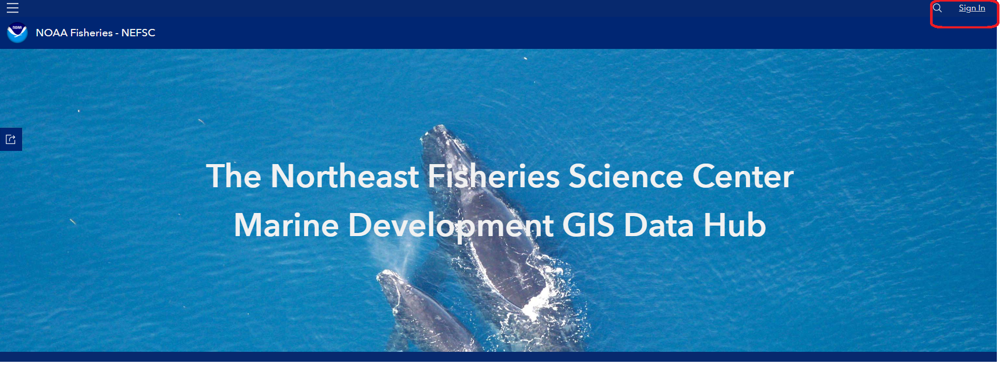
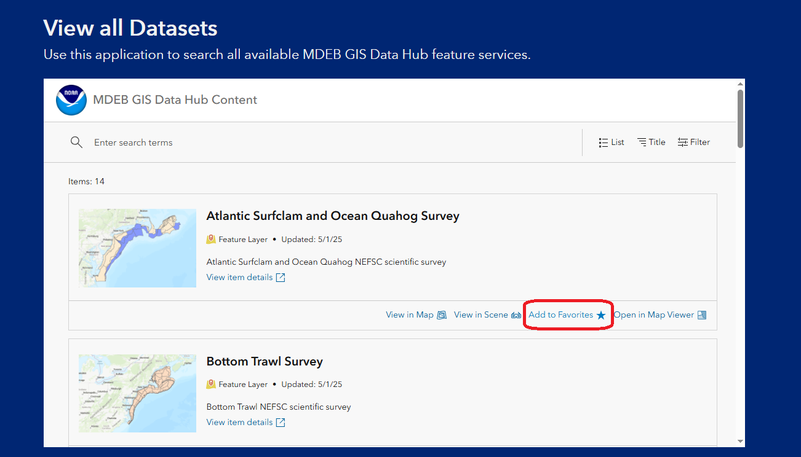
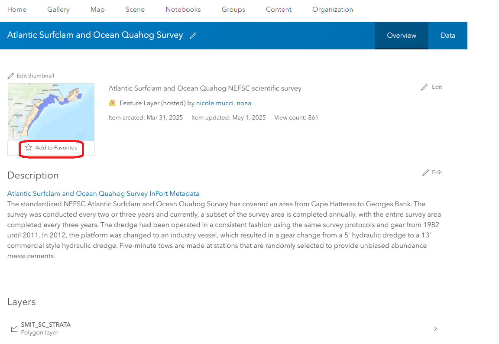
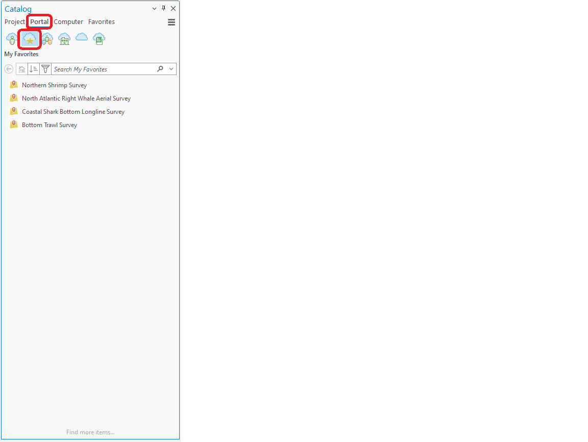
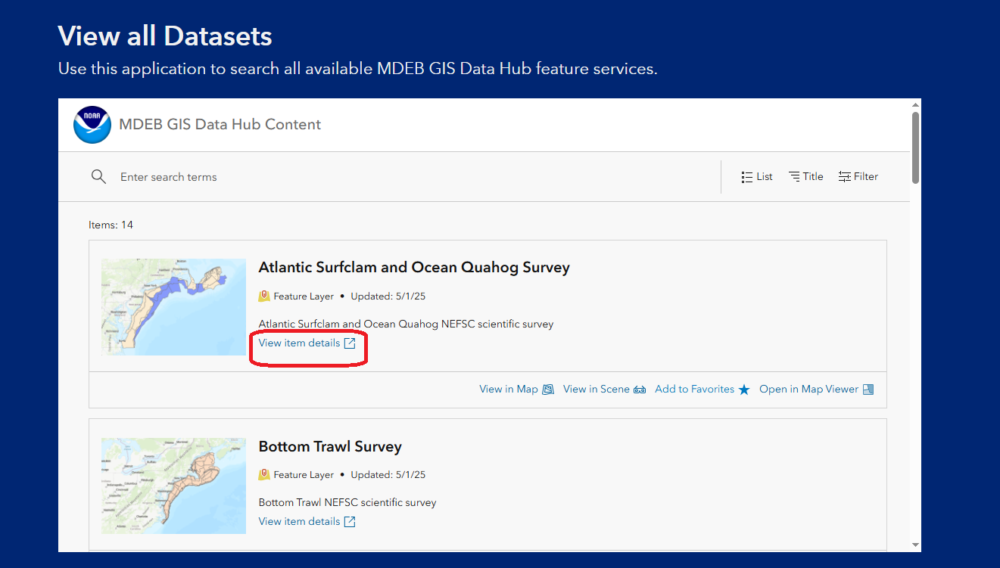
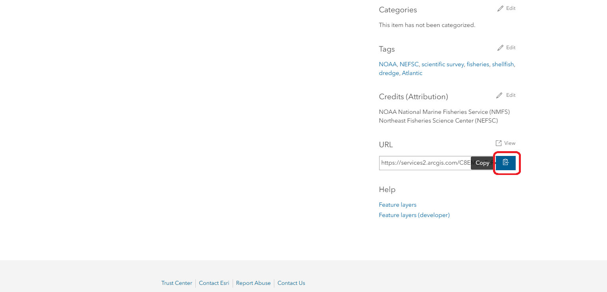
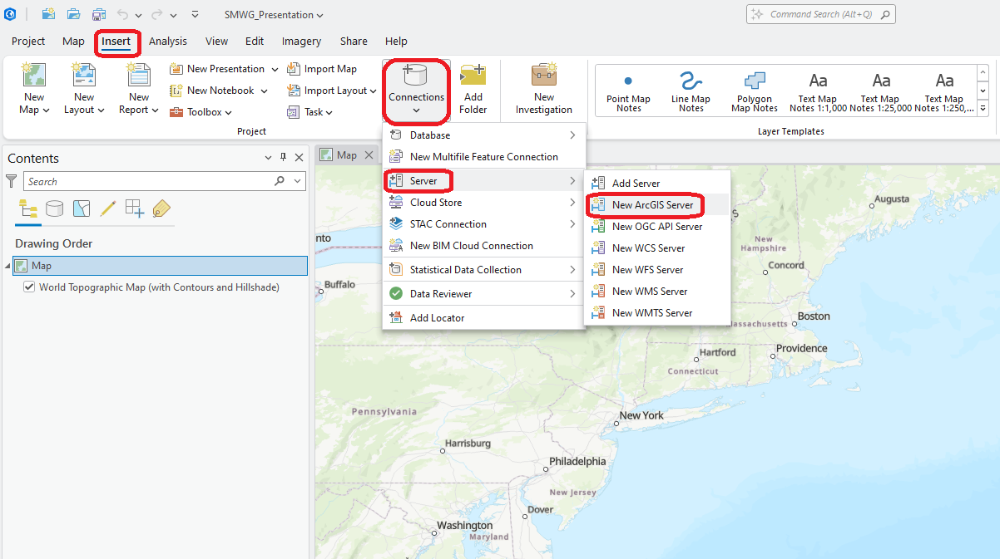
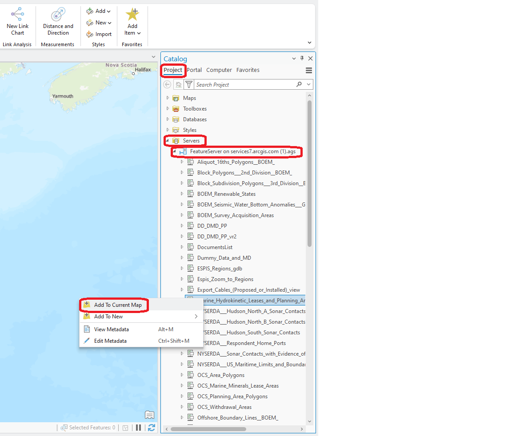

# Connecting ArcGIS Pro and AGOL

To access and use data from ArcGIS Online (AGOL) in ArcGIS Pro, you can 1) add data to your favorites or 2) connect to an ArcGIS Server using a REST URL.

## Add data to favorites

To add data to your favorites, navigate to the [MDEB GIS Data Hub](https://mdeb-nefsc-noaa.hub.arcgis.com/) and find your desired feature service using either the [Content library](https://mdeb-nefsc-noaa.hub.arcgis.com/search) or the Content gallery. We will use the Content gallery in this example. You must be signed in to ArcGIS Online to add content to your favorites. Click `Sign In` in the top-right corner of the MDEB GIS Data Hub to log in to your AGOL account. Follow prompts to log in.

```{r}
#| echo: false
#| out-width: 100%

```

After signing in, scroll through the gallery and find the feature service that you would like to add to your favorites. Click on the `Add to Favorites` button.

```{r}
#| echo: false
#| out-width: 100%

```

Alternatively, navigate to the feature service landing page by clicking on `View item details` in the Content gallery. On the feature service landing page, click `Add to Favorites` below the feature service thumbnail.

```{r}
#| echo: false
#| out-width: 100%

```

In ArcGIS Pro, ensure that you are logged in to your portal. If you are logged in, your name and portal name will appear in the top-right corner of the ArcGIS Pro window. If you are not signed in, click `Sign in` using the `Sign-in Status` button in the top-right corner of the ArcGIS Pro window and follow prompts to log in to your portal. Next, navigate to the Catalog Pane, click on `Portal`, then `My Favorites`. Any feature services that you have added to your favorites will appear here. Right click on the feature service and click `Add to Current Map` to add the feature service to your project.

```{r}
#| echo: false
#| out-width: 100%

```

## Connect to an ArcGIS Server using a REST URL

To add data to ArcGIS Pro via REST URL, first obtain the REST URL for the desired feature service from ArcGIS Online. You can obtain the REST URL from the [MDEB GIS Data Hub](https://mdeb-nefsc-noaa.hub.arcgis.com/) using either the [Content library](https://mdeb-nefsc-noaa.hub.arcgis.com/search) or the Content gallery. We will use the Content gallery in this example. First, scroll through the gallery and find the feature service that you are interested in. Click on `View item details` to be taken to the feature service landing page.

```{r}
#| echo: false
#| out-width: 100%

```

On the landing page, scroll to the bottom until you see `URL` in the right-side pane. Click the `Copy` button to copy the REST URL to your clipboard.

```{r}
#| echo: false
#| out-width: 100%

```

Then, open a new or existing project in ArcGIS Pro. On ArcGIS Pro, in the Header Ribbon click on `Insert`. In `Insert`, click on `Connections`, then `Server`, then `New ArcGIS Server`.

```{r}
#| echo: false
#| out-width: 100%

```

Paste the URL into the `Add ArcGIS Server Connection` pop-up window in the `Server URL` box. Click `OK`. The ArcGIS Server connection will now appear in the Catalog Pane in the `Project` menu under `Servers`. Click on the right arrow to expand all server connections, and then click on the right arrow next to your desired server connection to see all feature services within the server. Right click on the desired feature service and click `Add to Current Map` to add the feature service to your project.

```{r}
#| echo: false
#| out-width: 100%

```
